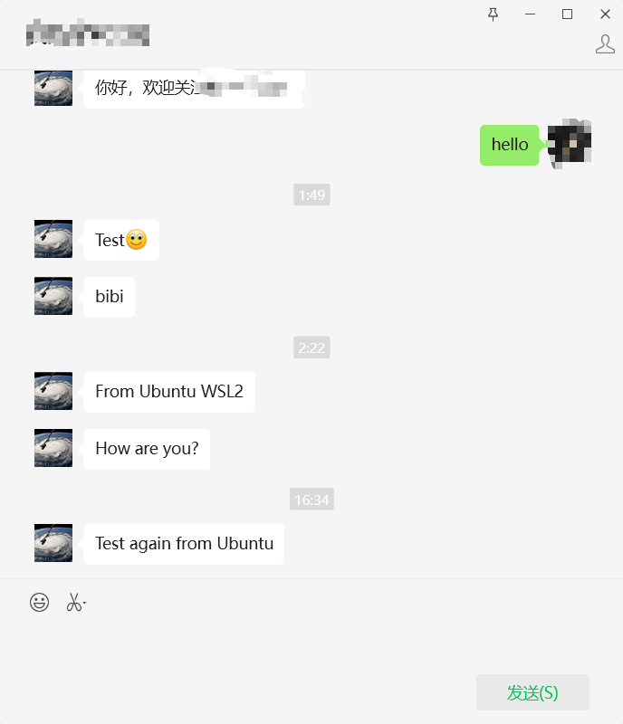

# Tracking Manuscript Status
This repository is aimed to create an agent to monitor the status of manuscript you submitted and remind you when changed.
* **Lightweight** Only python scripts
* **Simple and configurable**
* **mail or Wechat** notifactions support

## Required
1. Python 3.11.4 or higher
2. Edge Browser and Edge Web Driver installed.
>[!IMPORTANT]
>The version of browser must be consistend with web driver.
3. Selenium 4.21.0 or higher (**must above 4.0**) and urllib3 must be version 1.26.2
4. Beautifulsoup4 4.12.2 or higher

>[!NOTE]
>Other version may be useful but not tested. Only Ubuntu 20.04 tested succesfully.

## Optional
1. A Wechat public account. (Need OpenID)
    1. Check the OpenID for the user subscribed the publica account
    2. You could see the OpenID in `user management` in background of offical account. Open web developer tool `F12` to select the user logo and appear the value.
3. A mail account support SMTP (QQ, 163 or Google). Remeber configure the authorization code not the password you login

## How to run
1. add the manuscript login website, user and password in the python script.
2. `nohup python tracking_nc.py > tracking_nc.log 2>&1 &`

## Results
If successfuly, you would receive the message from mail or wechat offical accout like this

## Star History

## References
1. [python开发微信公众号发送消息](https://zhuanlan.zhihu.com/p/665967722)
